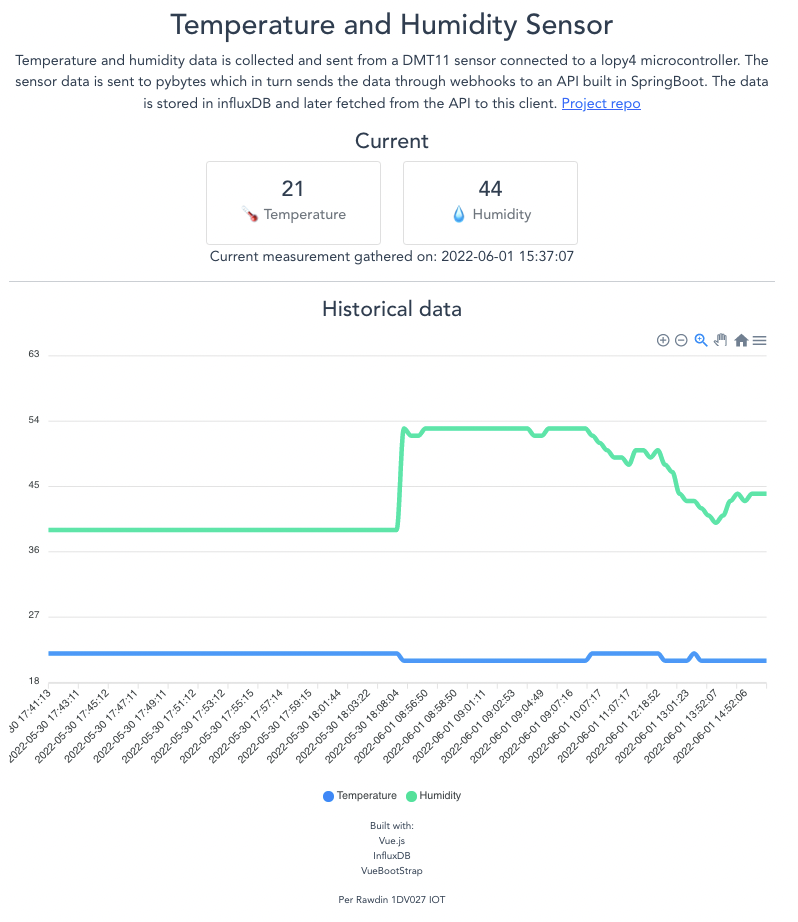

# Dashboard for IOT project

 Temperature and humidity data is collected and sent from a DMT11 sensor connected to a lopy4 microcontroller. The sensor data is sent to pybytes which in turn sends the data through webhooks to an API built in SpringBoot. The data is stored in influxDB and later fetched from the API to this client. 
 

## Built with:

- Vue.js
- Axios
- ApexCharts
- VueBootstrap
